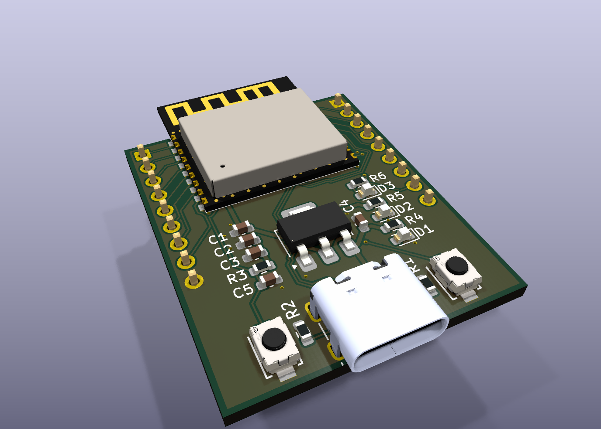
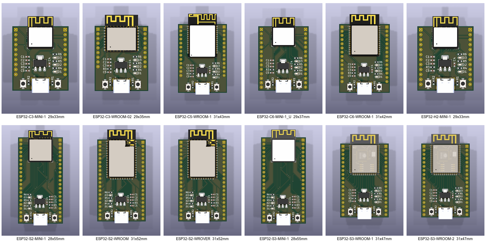
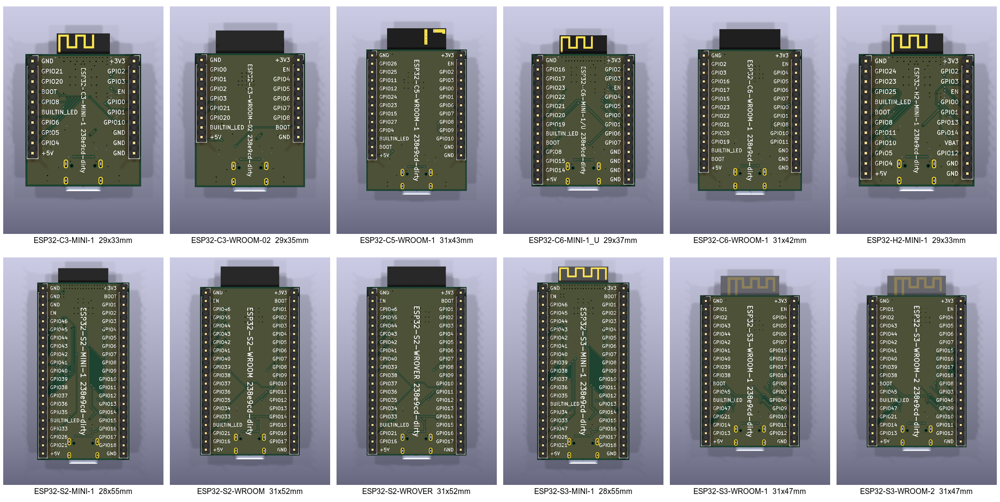

# ESP Dev-Board Generator

Generates canonical "basic dev board" KiCad schematics for the Espressif modules
that have a **PCB antenna + native USB** (12 modules across S2/S3/C3/C5/C6/H2).
Each board takes a shared skeleton (USB-C, 3V3 LDO, BOOT/EN buttons, LEDs) and
adds the module symbol + two break-out pin headers, wired entirely with net
labels (no routing). Output is a complete, openable KiCad project per module.

> **Why / design rationale:** see [`DECISIONS.md`](DECISIONS.md). This file is
> the *operational* guide; DECISIONS.md is the *why*.

## What it builds



Every board is the same canonical dev board — USB-C, 3V3 LDO, BOOT/EN buttons,
power + user LEDs — plus the module and its full GPIO break-out on two headers
(that's the ESP32-C3-WROOM-02 above; every component carries its 3D model, so
each board renders assembly-ready). The views below are to scale (equal
mm-per-pixel; each label carries the board's WxH):



The back silk labels every header pin with its net name and carries a vertical
board identifier — the module name plus the git revision that generated it
(`git describe --tags --always --dirty`):



These are snapshots of what `make.py --render` writes to `build/`: seven
montages (`montage_{top,top_bare,bottom}[_scale].png` — auto-fit and to-scale —
plus `montage_hero.png`) and a perspective `render_hero.png` per board under
`build/<MODULE>/`. To refresh them:

```bash
cp build/montage_{top,bottom}_scale.png docs/images/
cp build/ESP32-C3-WROOM-02/render_hero.png docs/images/hero.png
```

## Prerequisites (per machine)

1. **KiCad 10.x** installed (the schematics use the v10 file format).
2. **Espressif KiCad libraries installed *for that same KiCad version*** via
   KiCad's **Plug-in & Content Manager** (open KiCad 10 → PCM → search
   "Espressif" → install "Espressif KiCad Libraries" → Apply). This provides the
   `PCM_Espressif` symbol/footprint libraries. *This is the one manual install
   step and must be done before running anything.*
   > ⚠️ The addon is installed **per KiCad major version**. Having it for
   > KiCad 8/9 does **not** count if you run KiCad 10 — the PCM stores each
   > version's addons under a separate `Documents/KiCad/<version>/3rdparty` dir.
   > `resolve_library.py` pins to your running `kicad-cli` version and will
   > **hard-fail** (with these instructions) if the addon is missing for it,
   > rather than silently mixing libraries across versions.
3. **[uv](https://docs.astral.sh/uv/)** (Python package manager).
4. Internet access to `https://www.atomic14.com/esp32/` (only needed when
   curating a new module's `board.yaml`).

`resolve_library.py` auto-locates KiCad on macOS / Linux / Windows. If it can't,
set `ESPRESSIF_3RDPARTY` (the `<kicad>/3rdparty` dir) and/or `KICAD_CLI`
(path to `kicad-cli`) and re-run it. **Re-run it after any KiCad upgrade /
reinstall** — `library.json` records absolute, version-specific paths, and
`make.py` will refuse to run (pointing you back here) if those paths go stale.

## Quick start

```bash
uv sync                                   # restore the Python env (pinned in uv.lock)
uv run python scripts/resolve_library.py  # detect KiCad/libraries -> library.json (once/machine)
uv run python scripts/make.py             # build + route every board (THE command)
```

`make.py` is the one front door — it chains clean → build → route → render:

```bash
uv run python scripts/make.py            # build + route all modules
uv run python scripts/make.py --clean    # wipe prior output first
uv run python scripts/make.py --render    # also render the 3D montages
uv run python scripts/make.py --fab       # also export fab zips (Gerbers + drill)
uv run python scripts/make.py --all       # clean + build + route + render + fab
uv run python scripts/make.py --no-route  # build only
```

Generated boards land in `out/<MODULE>/<MODULE>.kicad_sch` (+ `.kicad_pro`,
`.kicad_pcb`); validation artifacts (ERC JSON, PDF render) in `build/<MODULE>/`.
Open any `out/<MODULE>/<MODULE>.kicad_pro` in KiCad. Both `out/` and `build/` are
git-ignored and fully disposable — `make.py --clean` (or `clean.py`) just removes
them. The curated source in `modules/` is never touched.

## Repository layout

```
DECISIONS.md            design decisions + rationale (read for the "why")
library.json            GENERATED per machine by resolve_library.py (git-ignore-able)
pyproject.toml/uv.lock  pinned Python env (kicad-skip, sexpdata, pyyaml)
baseline-left-en/       skeleton KiCad project (INPUT — never edit); EN button on the left
baseline-right-en/      same skeleton mirrored, EN on the right — generator auto-picks per module
  BasicEsp32Footprints.pretty/, 3d-models/, fp-lib-table   project-local footprints + 3D models
scripts/                orchestrators (run these); scripts/lib/ holds the per-module primitives
modules/<MODULE>/        CURATED SOURCE only (committed) — clean never touches it
  board.yaml            the only hand-authored file (see below)
  pinout.json           extracted from the symbol (never hand-edit); cached source
out/<MODULE>/            GENERATED board (git-ignored, disposable: rm -rf out)
  <MODULE>.kicad_sch/pro/pcb   the board — open <MODULE>.kicad_pro in KiCad
  fp-lib-table + *.pretty/ + asset dirs   copied from baseline
  route_debug/          per-stage routing snapshots for inspection
  fab/ + <MODULE>-fab.zip   Gerbers + Excellon drill; the .zip is fab-ready
build/<MODULE>/          GENERATED validation artifacts (git-ignored, disposable)
docs/AGENT_END_TO_END.md  agent spec: curate every board.yaml, then pilot-verify one module
docs/images/             committed montage snapshots referenced by this README

```

## The pipeline (`scripts/`)

**Orchestrators** — the top-level commands you run:

| Script | Role | Deterministic? |
|---|---|---|
| `make.py` | **THE command** — chains clean → build → route → render → fab (flags toggle stages) | ✅ |
| `resolve_library.py` | Find KiCad libs + `kicad-cli` → `library.json` | ✅ run once/machine |
| `build_all.py [--clean]` | extract → build → validate every curated module | ✅ |
| `route_all.py [--no-diff]` | autoroute every board (diff-pair with single-ended fallback; writes back in place) + DRC | ✅ |
| `render_boards.py` | 3D montages of every board → `build/` (top, top-bare/no-components, bottom — each auto-fit AND to-scale — plus a perspective hero shot per board) | ✅ |
| `fab_all.py` | Gerber + Excellon drill zip per board → `out/<M>/<M>-fab.zip` | ✅ |
| `clean.py` | remove generated output for a fresh run — just `rm -rf out build`; the curated `modules/` source is never touched | ✅ |

**Primitives** (`scripts/lib/`) — operate on one module; called by the orchestrators, rarely run directly:

| Script | Role |
|---|---|
| `extract_pinout.py "<MODULE>"` | Parse the symbol → `modules/<m>/pinout.json` |
| `footprint_edges.py "<MODULE>"` | Physical pin edges from the footprint |
| `build_board.py "<MODULE>"` | **The generator**: module + perimeter-split headers + labels + footprints + project files (copies the baseline's `fp-lib-table` and all asset dirs — `*.pretty` footprint libs, `3d-models/`, etc.) |
| `route_board.py "<MODULE>"` | Autoroute one board (USB-C fine neck, signals, GND pour) |
| `place_pcb.py` / `gnd_finish.py` / `gnd_prestitch.py` | PCB placement + GND-pour fill/stitch helpers (prestitch protects GND pads before routing) |
| `validate.py <sch>` | ERC delta vs baseline + PDF render |
| `fab_export.py "<MODULE>"` | Gerbers (`--check-zones` refills pours) + Excellon drill → zipped fab package |

**~95% of the work is fully scripted.** The only step needing human/agent
judgement is curating each module's `board.yaml`.

## Adding / re-curating a module

`board.yaml` is the one hand-authored file. Most wiring is auto-derived (power,
GND, EN, USB→D±, GPIO→`GPIOxx` labels). You decide:

- **`do_not_break_out`**: pins that must NOT be exposed — internal flash/PSRAM
  and any pin the [atomic14 module page](https://www.atomic14.com/esp32/modules/)
  marks as a hard "do not use". Strapping / JTAG / UART / USB pins are still
  broken out (documented in `notes`, not excluded).
- **`strapping` / `input_only`**: GPIO numbers (curated from the atomic14 page /
  datasheet) that are sampled at reset or have no output driver. They're *still*
  broken out — these lists only steer the on-board LED away from unsafe pins.
- **`builtin_led`**: the GPIO the skeleton's on-board LED attaches to. The
  generator routes it to the **safe pad physically nearest the LED** on the laid-out
  PCB (shortest trace); `build_board.py pick_builtin_led()` computes exactly that,
  and the build **hard-errors** if `builtin_led` names a strapping / input-only /
  non-broken-out pin. "Safe" = I/O-capable, non-strapping, broken-out GPIO.
- **`boot`**: the download/boot strapping GPIO the on-board BOOT button pulls low —
  GPIO0 on Xtensa (ESP32/-S2/-S3), GPIO9 on most RISC-V (-C3/-C6/-H2), GPIO28 on
  -C5. Varies per module, so the generator aliases the skeleton's `BOOT` net onto it.

```yaml
module: ESP32-S3-WROOM-1
symbol: PCM_Espressif:ESP32-S3-WROOM-1
do_not_break_out: [SPIDQS, SPIIO6, SPIIO7]   # octal flash/PSRAM, must not expose
overrides: {}
strapping: [0, 3, 45, 46]   # sampled at reset — unsafe for the LED (GPIO45 = VDD_SPI)
input_only: []              # no output driver
builtin_led: GPIO48         # safe GPIO pad nearest the on-board LED (NOT GPIO45, a strap)
boot: GPIO0                 # download/boot strapping pin the BOOT button pulls low
notes: >
  Source: https://www.atomic14.com/esp32/modules/esp32-s3-wroom-1/ ...
```


> ⚠️ Curation is **symbol-specific, not name-based**: e.g. `SPIIO6/7`/`SPIDQS`
> are reserved on the octal S3-WROOM-1, but are *freely-usable GPIO* on the quad
> S3-MINI-1 (and are NC, so absent, on the WROOM-2). Check the atomic14 page;
> don't blindly exclude by name.

Then: `uv run python scripts/lib/build_board.py "<MODULE>"` and
`uv run python scripts/lib/validate.py out/<m>/<m>.kicad_sch`, and **open the
rendered PDF** — the visual check catches things ERC can't (it once passed a
board whose USB pins were unconnected).

## Validation

`validate.py` gate = **no new ERROR-severity ERC violations vs the baseline**.
New *warnings* are expected and fine (notably the `pin_to_pin` from connecting
`GPIO0` to the boot button — the EasyEDA button symbol uses `Unspecified` pin
types). The baseline itself has ~58 pre-existing violations, so the bar is the
*delta*, not zero. Always also eyeball the PDF render.

## Fabrication

`make.py --fab` (or `fab_all.py`, or `fab_export.py "<M>"` for one) exports a
fab-ready package per board to `out/<M>/<M>-fab.zip` (loose files also in
`out/<M>/fab/`). The zip holds the standard 2-layer Gerber set (`F.Cu B.Cu`,
paste, silkscreen, mask, `Edge.Cuts`) plus an Excellon drill file, drill map,
and `.gbrjob` — flat-zipped, ready to upload to JLCPCB / PCBWay / most houses.

Key detail: the Gerber export runs with `--check-zones`, which **refills the
copper pours during export**, so the GND plane is always present in the copper
Gerbers even though headless tools save boards with empty fills — otherwise
you'd ship a board with no ground plane. Coordinates use an absolute origin for
both Gerbers and drill so they align. If your fab wants PTH/NPTH drills split,
add `--excellon-separate-th` in `fab_export.py` (currently combined).

**Silk order-number marker.** `build_board` drops a small F-silk text
(`SILK_MARKER_TEXT`, default `"WayWayWay"`) centred in the clear band just above
the module's bottom pin row — under the body, so it's hidden once the module is
soldered down, and never on exposed copper (its real rendered bounding box is
clearance-checked against every pad, and the size auto-shrinks on tight modules).
This gives the board house a designated spot for its order number instead of it
landing on visible silk. Change the text via `SILK_MARKER_TEXT` in `place_pcb.py`.

**Back-silk board identifier.** Each board also gets a vertical B-silk text
centred on the back: `"<module> <git describe --tags --always --dirty>"` — so a
physical board always names its module and the exact repo revision that
generated it. Tag the repo (e.g. `v1.0`) to get a clean rev number on the silk;
between tags it reads `v1.0-3-g<hash>`, and `-dirty` flags uncommitted changes.
The text auto-sizes to the board height (1.5 mm down to a 0.8 mm floor,
dropping the revision before the name if it can't fit) — see
`place_pcb.board_id_text`.

## CI / Releases

`.github/workflows/build.yml` runs the whole pipeline on GitHub Actions
(Ubuntu): KiCad 10 from the official PPA, the Espressif PCM addon unpacked
headlessly into the layout `resolve_library.py` expects, then
`xvfb-run make.py --all`. Every push to `main` uploads the boards as a
workflow artifact; pushing a version tag (`git tag v1.1 && git push --tags`)
additionally publishes a GitHub **release** with the per-board fab zips, KiCad
project zips, and the montages attached. Boards built from a tag carry that
version on their back silk (the identifier bakes in `git describe`).

## Handoff notes

To pass this on: ship the whole directory **except `.venv/`** (regenerated by
`uv sync`) and `library.json`/`out/`/`build/` (regenerated per machine). The
recipient runs the three Quick-start commands. The curated `modules/<M>/board.yaml`
(+ `pinout.json`) are the valuable hand-work and are the only committed per-module
files.
